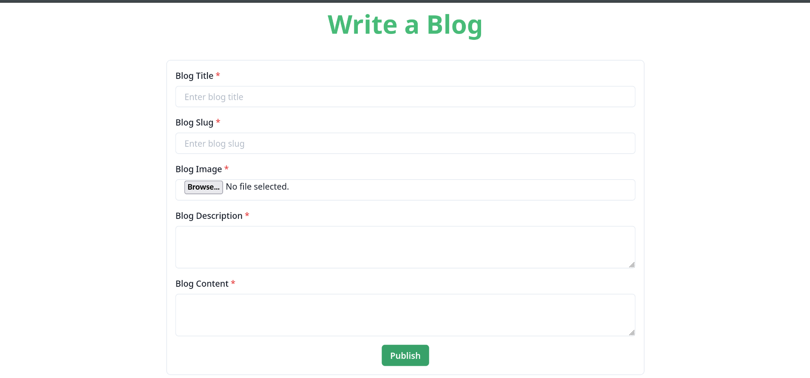
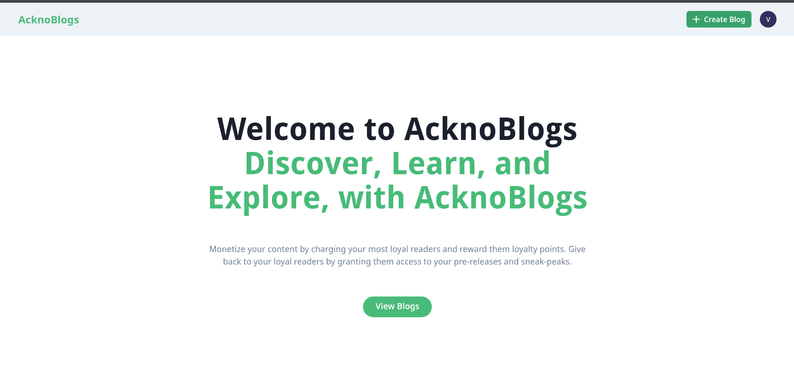
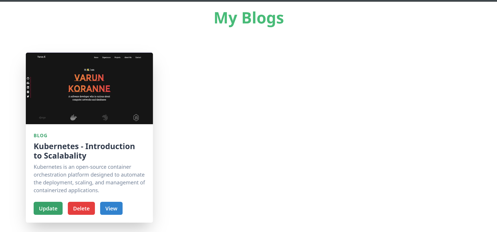

<!-- Improved compatibility of back to top link: See: https://github.com/othneildrew/Best-README-Template/pull/73 -->

<a name="readme-top"></a>

<!--
*** Thanks for checking out the Best-README-Template. If you have a suggestion
*** that would make this better, please fork the repo and create a pull request
*** or simply open an issue with the tag "enhancement".
*** Don't forget to give the project a star!
*** Thanks again! Now go create something AMAZING! :D
-->

<!-- PROJECT SHIELDS -->
<!--
*** I'm using markdown "reference style" links for readability.
*** Reference links are enclosed in brackets [ ] instead of parentheses ( ).
*** See the bottom of this document for the declaration of the reference variables
*** for contributors-url, forks-url, etc. This is an optional, concise syntax you may use.
*** https://www.markdownguide.org/basic-syntax/#reference-style-links
-->

[![Contributors][contributors-shield]][contributors-url]
[![Forks][forks-shield]][forks-url]
[![Stargazers][stars-shield]][stars-url]
[![Issues][issues-shield]][issues-url]
[![MIT License][license-shield]][license-url]
[![LinkedIn][linkedin-shield]][linkedin-url]

<!-- PROJECT LOGO -->
<br />
<div align="center">
<h3 align="center">AcknoBlogs</h3>

  <p align="center">
    A blog application built for acknoledger
    <br />
    <a href="https://github.com/Varun-Dhruv/AcknoBlogs"><strong>Explore the docs »</strong></a>
    <br />
    <br />
    <a href="https://github.com/Varun-Dhruv/AcknoBlogs">View Demo</a>
    ·
    <a href="https://github.com/Varun-Dhruv/AcknoBlogs/issues">Report Bug</a>
    ·
    <a href="https://github.com/Varun-Dhruv/AcknoBlogs/issues">Request Feature</a>
  </p>
</div>

<!-- TABLE OF CONTENTS -->
<details>
  <summary>Table of Contents</summary>
  <ol>
    <li>
      <a href="#about-the-project">About The Project</a>
      <ul>
        <li><a href="#built-with">Built With</a></li>
      </ul>
    </li>
    <li>
      <a href="#getting-started">Getting Started</a>
      <ul>
        <li><a href="#prerequisites">Prerequisites</a></li>
        <li><a href="#installation">Installation</a></li>
      </ul>
    </li>
    <li><a href="#usage">Usage</a></li>
    <li><a href="#contributing">Contributing</a></li>
    <li><a href="#license">License</a></li>
    <li><a href="#contact">Contact</a></li>
  </ol>
</details>

<!-- ABOUT THE PROJECT -->

## About The Project

[![Product Name Screen Shot][product-screenshot]](https://example.com)

It is a sample blog project developed for AcknoLedger.

<p align="right">(<a href="#readme-top">back to top</a>)</p>

### Built With

- [![Next][Next.js]][Next-url]
- [![React][React.js]][React-url]
- [![Express][Express.js]][Express-url]
- [![Node][Node.js]][Node-url]
- [![MongoDB][MongoDB]][Mongo-url]

<p align="right">(<a href="#readme-top">back to top</a>)</p>

<!-- GETTING STARTED -->

## Getting Started

This is an example of how you may give instructions on setting up your project locally.
To get a local copy up and running follow these simple example steps.

### Installation & Setup

Add the following keys in envs/.env.local

```
  DATABASE_URL="mongo-database-url "
  JWTPRIVATEKEY="myprivatekey"
  NEXT_PUBLIC_SERVER_URL="backend-url"
```

To run the project on local use

```
 $ make compose-up
```

<p align="right">(<a href="#readme-top">back to top</a>)</p>

## Usage & Features

<p align="right">(<a href="#readme-top">back to top</a>)</p>

- [x] Authentication
- [x] CRUD on blogs
- [x] User Based Authorization
- [x] Pagination
- [x] Markdown Rendering
- [x] File Handling

</img>
</img>
</img>
</img>

<!-- ROADMAP -->

## Contributing

Contributions are what make the open source community such an amazing place to learn, inspire, and create. Any contributions you make are **greatly appreciated**.

If you have a suggestion that would make this better, please fork the repo and create a pull request. You can also simply open an issue with the tag "enhancement".
Don't forget to give the project a star! Thanks again!

1. Fork the Project
2. Create your Feature Branch (`git checkout -b feature/AmazingFeature`)
3. Commit your Changes (`git commit -m 'Add some AmazingFeature'`)
4. Push to the Branch (`git push origin feature/AmazingFeature`)
5. Open a Pull Request

<p align="right">(<a href="#readme-top">back to top</a>)</p>

<!-- LICENSE -->

## License

Distributed under the MIT License. See `LICENSE.txt` for more information.

<p align="right">(<a href="#readme-top">back to top</a>)</p>

## Contact

Varun Koranne - [@Varun-Dhruv](https://twitter.com/Varun-Dhruv) - korannevarun@gmail.com

Project Link: [https://github.com/Varun-Dhruv/AcknoBlogs](https://github.com/Varun-Dhruv/AcknoBlogs)

<p align="right">(<a href="#readme-top">back to top</a>)</p>

<!-- MARKDOWN LINKS & IMAGES -->
<!-- https://www.markdownguide.org/basic-syntax/#reference-style-links -->

[contributors-shield]: https://img.shields.io/github/contributors/Varun-Dhruv/AcknoBlogs.svg?style=for-the-badge
[contributors-url]: https://github.com/Varun-Dhruv/AcknoBlogs/graphs/contributors
[forks-shield]: https://img.shields.io/github/forks/Varun-Dhruv/AcknoBlogs.svg?style=for-the-badge
[forks-url]: https://github.com/Varun-Dhruv/AcknoBlogs/network/members
[stars-shield]: https://img.shields.io/github/stars/Varun-Dhruv/AcknoBlogs.svg?style=for-the-badge
[stars-url]: https://github.com/Varun-Dhruv/AcknoBlogs/stargazers
[issues-shield]: https://img.shields.io/github/issues/Varun-Dhruv/AcknoBlogs.svg?style=for-the-badge
[issues-url]: https://github.com/Varun-Dhruv/AcknoBlogs/issues
[license-shield]: https://img.shields.io/github/license/Varun-Dhruv/AcknoBlogs.svg?style=for-the-badge
[license-url]: https://github.com/Varun-Dhruv/AcknoBlogs/blob/master/LICENSE.txt
[linkedin-shield]: https://img.shields.io/badge/-LinkedIn-black.svg?style=for-the-badge&logo=linkedin&colorB=555
[linkedin-url]: https://linkedin.com/in/linkedin_username
[product-screenshot]: images/screenshot.png
[Next.js]: https://img.shields.io/badge/next.js-000000?style=for-the-badge&logo=nextdotjs&logoColor=white
[Next-url]: https://nextjs.org/
[React.js]: https://img.shields.io/badge/React-20232A?style=for-the-badge&logo=react&logoColor=61DAFB
[React-url]: https://reactjs.org/
[Node.js]: https://img.shields.io/badge/Node.js-43853D?style=for-the-badge&logo=node.js&logoColor=white
[Node-url]: https://nodejs.org/en/
[Express.js]: https://img.shields.io/badge/Express.js-404D59?style=for-the-badge
[Express-url]: https://expressjs.com/
[MongoDB]: https://img.shields.io/badge/MongoDB-4EA94B?style=for-the-badge&logo=mongodb&logoColor=white
[Mongo-url]: https://www.mongodb.com/
